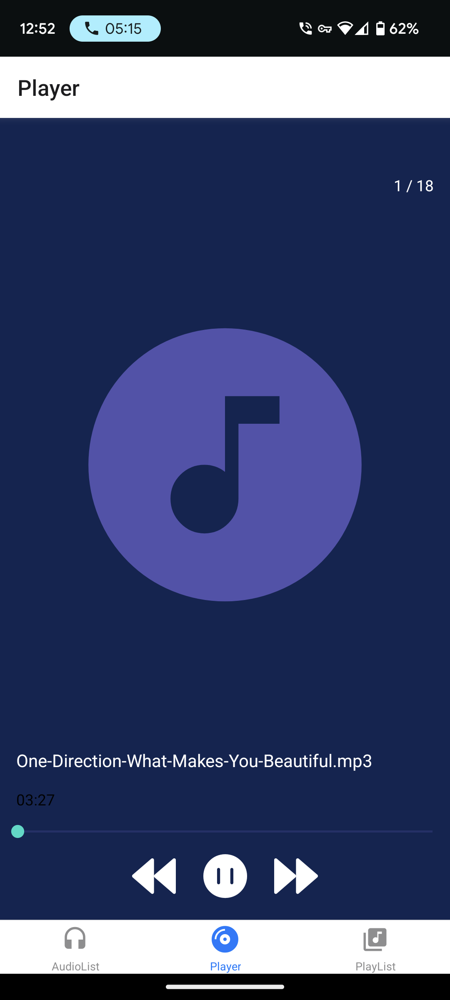
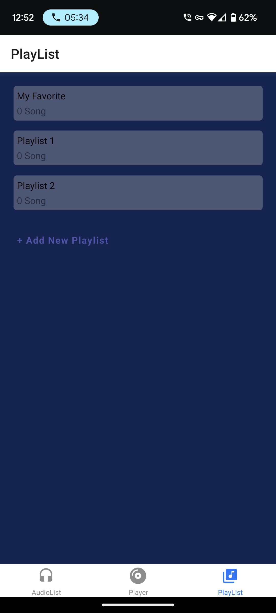

# Screenshot
  

# Music App

Welcome to the DJPunjab! This app allows you to listen to your favorite music tracks, create playlists, and discover new music.

## Installation

1. Clone the repository: `git clone https://github.com/your-username/MusicApp.git`
2. Install the dependencies: `npm install` (Just in case 'npm install' doesn't install all the required dependencies than please refer to 'package.json' and manually install all the dependencies and at the end run 'npm install -fix')
(One of the Prerequisite is there should be some audio files available on the device that the app is running on)

## Usage

1. Start the app: `npm start`
2. Open your web browser and go to `http://localhost:3000`
3. Press 'a' or simply scan the QR code in the 'Expo Go' app
